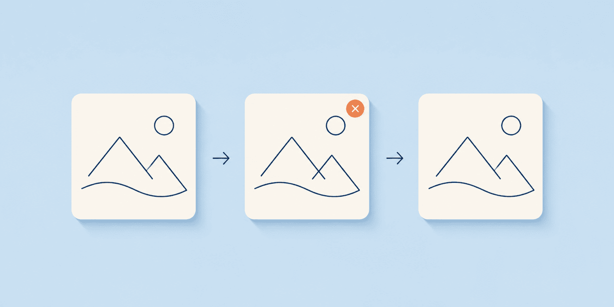

# 小红书封面委员会 Skill

English: [README.en.md](README.en.md) · 旧中文链接：[README.zh-CN.md](README.zh-CN.md) · [案例](docs/cases/README.md) · [贡献](CONTRIBUTING.md) · [跨仓导航](docs/cross-repo-navigation.md)



这是一套把“小红书图文封面看起来像后贴标题”的问题拆成可审阅步骤的 Agent Skill。它使用区域、禁区、标题承载物、文字方向、调试图与人工评审，帮助制作**待人工审核**的封面候选包。

> 75+ 次迭代、v59/v74/v75 和全部过程图只证明设计过程与规则如何收敛。它们**不是**已发布记录、流量数据、增长效果、平台推荐或任何商业结果。

## 解决的问题

| 输入 | 常见失败 | 此 Skill 的处理 | 输出边界 |
|---|---|---|---|
| 已有底图与中文标题 | 标题像贴纸、挡住脸或工具 | 定义可写区、禁区与标题层级 | 候选封面，不是发布稿 |
| 多主题封面 | 每张沿用同一安全矩形 | 选择物件承载/头顶/侧袋/信息带方案 | 规则选择记录 |
| 看似合格的画面 | 调试图只证明不遮挡 | 分开记录几何检查与审美复核 | 过程证据，不是效果证明 |

## 完整案例一：v59 → v74 → v75

| 阶段 | 有效方向 | 失败原因 | 修正规则 |
|---|---|---|---|
| v59 | 无底框、直排轴线、大字层级与主体避让 | 仍需更明确的主题承载与分区 | 直线文本优先，先确定对象与区域 |
| v74 | 主标题尝试贴合人物/任务轮廓 | 左右和下方文字无轮廓依据地弯曲，阅读节奏变弱 | 弧线必须有真实轮廓理由 |
| v75 | 主标题保留有依据的轮廓关系 | 不把调试通过当作审美或平台效果 | 左右/下方回归同方向直排；继续人工审阅 |

[阅读完整案例：问题、输入、方法、可复现输出、证据与边界](docs/cases/v59-v74-v75.md)。


## 完整案例二：物件承载而非安全矩形

当底图包含纸张、屏幕、白板或工作台时，标题应当有可说明的承载关系，而非只塞进固定左上角。案例把“避免遮挡”与“读起来像封面”拆开验证，并保留失败版作为反例。

[阅读完整案例](docs/cases/object-carrier.md)。该案例和全部仓库视觉均为过程资产；不宣称已经发布或带来增长。

## 3 分钟体验

要求：Node.js。此检查只验证本地包的文件、资源数量和 Markdown 链接，不上传图片，也不登录或发布。

```sh
git clone https://github.com/soarsky1991/xhs-cover-committee-skill.git
cd xhs-cover-committee-skill
node scripts/check-package.mjs
```

再按顺序打开 `assets/iteration-panels/` 的 v59、v74、v75 过程板，并对照 [案例一](docs/cases/v59-v74-v75.md) 判断：你是否能分别指出“有效方向”“失败原因”和“修正规则”。通过这项练习，不等于封面可以发布。

## 方法契约

1. 先写视觉 brief：受众、一个中心判断、必须文字、禁用风格与合规边界。
2. 为脸、手、关键工具、角色和证据区域画禁区；禁区通过仅是底线。
3. 选择布局家族：头顶主标题、无框直排、物件承载、侧袋、下方信息带或文章卡。
4. 仅让有真实轮廓理由的主标题弯曲；辅助文字保持可读的同轴/同方向关系。
5. 保存普通过程板、调试板、评审意见和下一轮要改的最高三项。
6. required 审核未通过时标记 `BLOCKED_DO_NOT_PUBLISH`；通过时也只到 `READY_FOR_HUMAN_REVIEW`。

详见：[方法](docs/method.zh-CN.md) · [布局方案](docs/layout-schemes.md) · [迭代故事](docs/iteration-story.zh-CN.md) · [图库](docs/gallery.zh-CN.md)。

## 安装为 Skill

```sh
mkdir -p ~/.codex/skills
ln -s "$(pwd)/skills/xhs-cover-committee" ~/.codex/skills/xhs-cover-committee
```

新任务中可以这样请求：

> 使用 `xhs-cover-committee`，为这组图文先生成 visual brief、禁区和两个布局方案；输出只到 `READY_FOR_HUMAN_REVIEW`，不要发布。

其他 Agent 可先完整阅读 [SKILL.md](skills/xhs-cover-committee/SKILL.md) 再执行同一门禁。

## 证据与不支持的结论

| 可登记的证据 | 能支持什么 | 不能支持什么 |
|---|---|---|
| 普通过程板与调试板 | 布局版本及禁区检查发生过 | 发布、曝光、点击、收藏、增长 |
| 标题规则与 review note | 某条规则为何被保留或撤回 | 对任意受众/主题的必然效果 |
| 本地 `check-package` 输出 | 当前包的结构检查通过 | 平台审核通过或内容合规 |

不得上传第三方小红书截图、创作者头像、受限角色素材、客户资料或个人信息。具体媒体边界见 [NOTICE/ASSET_RIGHTS.md](NOTICE/ASSET_RIGHTS.md)。

## 贡献

新增版本必须提供普通过程板、调试图、版本说明、可复用规则与证据边界；不要只提交一张“更好看”的图。使用 [Issue 模板](.github/ISSUE_TEMPLATE) 提议案例或报告边界问题，并阅读 [CONTRIBUTING.md](CONTRIBUTING.md)。

维护者公开身份：马智辰（Zhichen Ma / 智辰老师） · soarhigh1991@gmail.com · X [@AI2studio](https://x.com/AI2studio)

## 资源导航

- [完整案例索引](docs/cases/README.md)
- [可复现实验入口](docs/reproduce.md)
- [跨仓导航](docs/cross-repo-navigation.md)
- [社交预览登记](docs/assets/README.md)

当前仓库的终点是可审阅的候选与证据链，而不是自动发布。
