# Gallery

The package keeps the main visual evidence in four folders:

- `assets/iteration-panels/` - the main ordinary comparison boards through v75.
- `assets/debug-panels/` - the main debug boards through v75.
- `assets/final-covers/` - five v73 single-cover exports kept as a consolidation checkpoint.
- `assets/current-covers/` - v75 corrected current covers plus v74 critique material.
- `assets/edge-evidence/` - six edge evidence images from v68.

## Milestone Comparison Boards

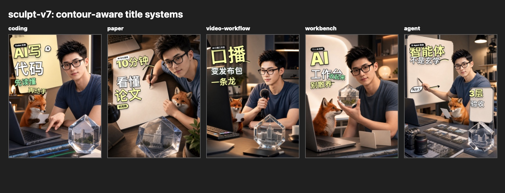
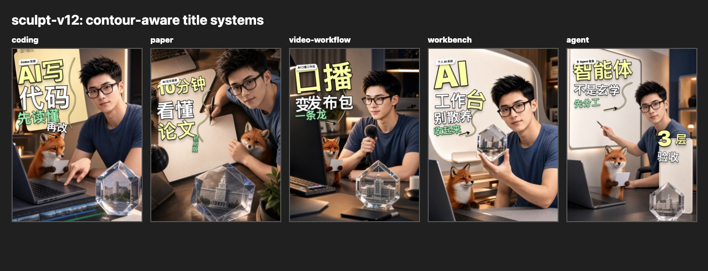

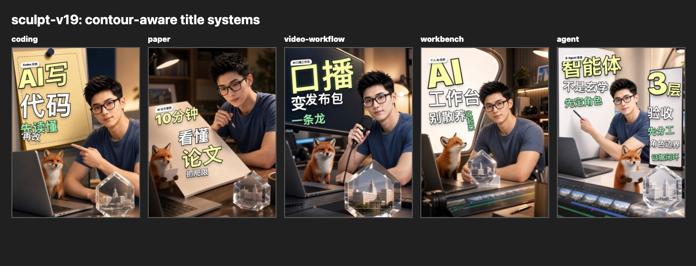

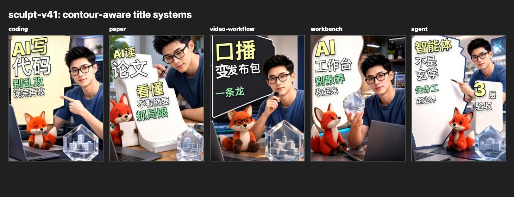
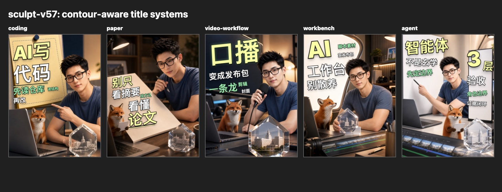

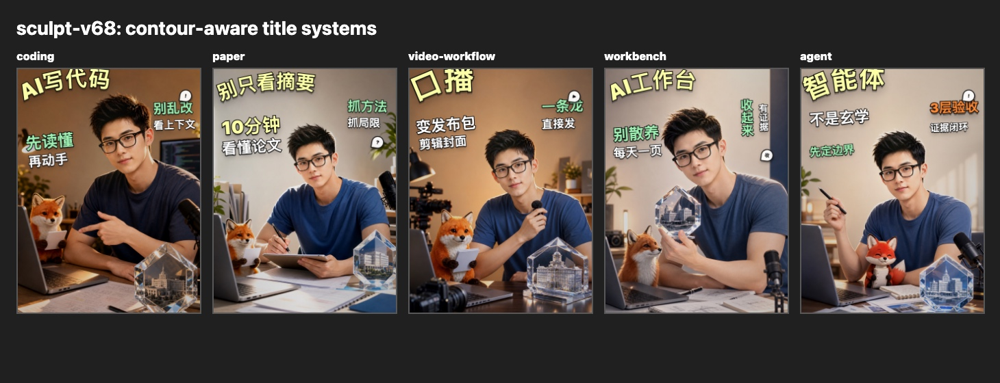

## Milestone Debug Boards

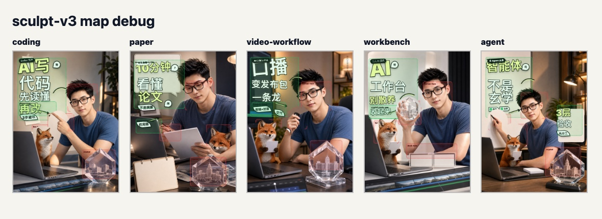
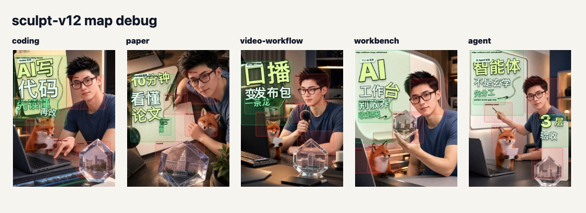
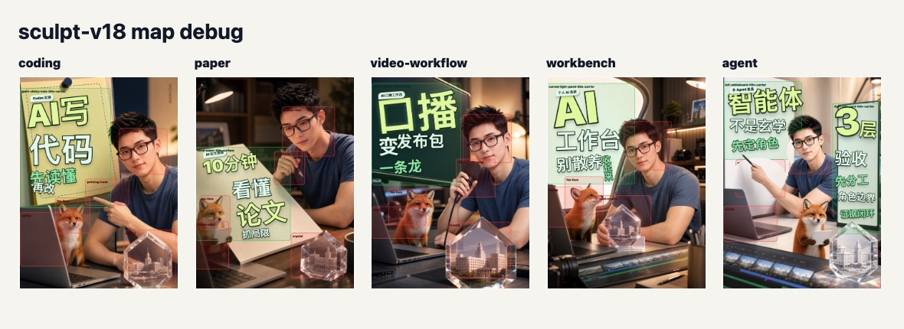
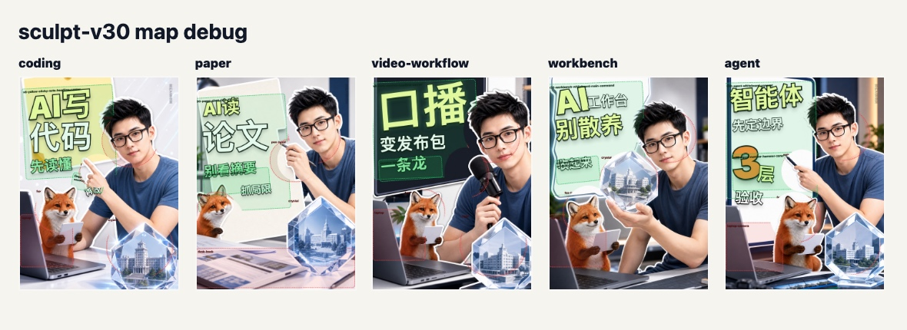
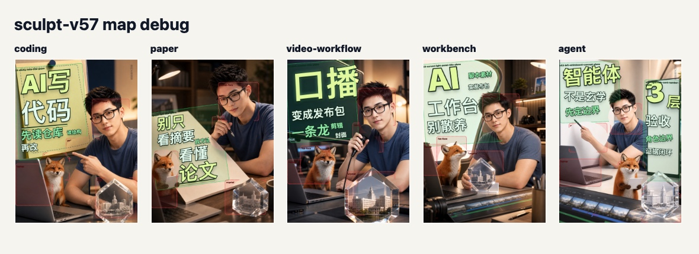

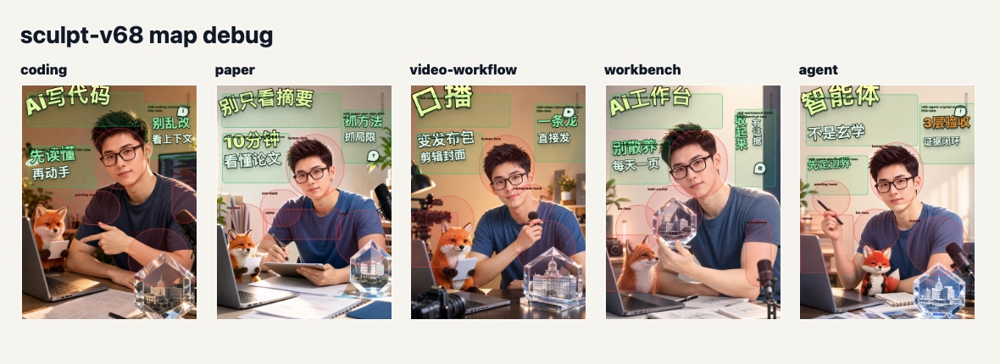

## Final v73 Single Covers

## Current v75 Single Covers

## Edge Evidence

## Full File Ranges

Use these filename ranges when browsing locally:

- ordinary boards: `assets/iteration-panels/ai-cover-title-layout-comparison-sculpt-v2.jpg` through `v75.jpg`;
- debug boards: `assets/debug-panels/ai-cover-title-layout-sculpt-v3-map-debug.jpg` through `v75-map-debug.jpg`;
- final single covers: `assets/final-covers/ai-*-xhs-cover-sculpt-v73-1080x1440.jpg`.
- current single covers: `assets/current-covers/ai-*-xhs-cover-sculpt-v75-1080x1440.jpg`.

The v74 current-cover files are critique evidence. The v75 current-cover files are the corrected current case, not the end of the system.

Not every version number has the same lesson. The useful reading pattern is to compare an ordinary board with its debug board, then read `docs/iteration-story.md` for the rule that changed afterward.
