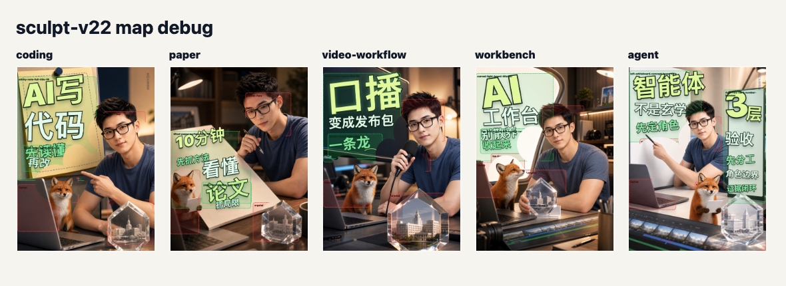

# Iteration Story: v2 to v75

This story is about one repeated failure: the cover image looked good, but the title did not belong to the image. The solution was not one prompt, one font, or one magic template. It was a committee loop: render, inspect, label failure, write a new rule, generate a comparison board, then make the next version harder to fool.

## Phase 1: Fixed Overlay Fails, v2-v6

The first passes treated the title as a safe overlay. The text avoided obvious faces, but it still behaved like a poster sticker placed after the photograph was done.

What failed:

- too many covers shared the same top-left title rhythm;
- small labels filled space but did not create a cover structure;
- subject details such as the fox, hands, and crystal were protected only by rough rectangles;
- the title did not follow the visual objects in each image.

The first upgrade was region awareness: mark faces, hands, fox face, crystal, screen, paper, and blank wall separately before placing text.

## Phase 2: Object Carriers Replace Abstract Safe Areas, v7-v18

The next discovery was uncomfortable but useful: a good title layer cannot rescue a weak carrier image. If the base image has only empty wall, the title will still feel pasted on.

The system shifted from abstract safe zones to named carriers:

- coding: sticky-note or laptop-side title carrier;
- paper: paper surface or annotation bubble;
- video: dark monitor or timeline surface;
- workbench: light board that can bend around the crystal;
- agent: whiteboard plus role-card number hammer.

The stable style remained thick outline, high contrast, and strong variety in word scale. The variable part became the title structure for each theme.

## Phase 3: Contour, Perspective, and Depth, v19-v30

Once carriers existed, the title still needed to sit in space. Flat text on a slanted paper, screen, or board looked artificial, even when it passed collision checks.

Rules added in this phase:

- skew or rotate titles lightly to follow paper/screen/board perspective;
- allow foreground cutouts for hands, fox, crystal, or microphone to sit above the title edge;
- keep human face as a hard forbidden zone;
- treat allow-zones as carefully labeled depth effects, not as permission to cover the subject;
- review both full-size and thumbnail readability.

This phase taught the system that "no collision" is only the floor. The title must also have spatial agreement with the image.

## Phase 4: Alignment, No-Frame Direction, and Evidence Boards, v41-v68

By the middle passes, hand-labeled rectangles were no longer enough. The system needed visual evidence for real object edges: whiteboard boundaries, paper diagonals, screen edges, crystal contours, fox head, and hand silhouettes.

Edge evidence was introduced as a review artifact, not as an automatic layout engine. The title was still placed deterministically in HTML, but the edge board made the next human/agent decision more honest.

v59 remains an important checkpoint. It removed the bottom-frame feeling and kept side/lower text mostly straight. That version taught a rule that later experiments temporarily forgot: attaching text to a subject does not mean bending every line.

The review checklist became:

- first glance: can the title be read?
- second glance: are creator, fox, and crystal still visible?
- third glance: does the text edge attach to a real carrier?
- debug glance: do title boxes, forbidden zones, and edge evidence agree?

## Phase 5: v69-v73, Consolidation

The late versions consolidated the system rather than adding more decoration. The best direction was less about lines, arrows, or badges, and more about title mass, object carriers, and theme-specific structure.

The v73 package keeps five cover themes:

- coding: tutorial-like title mass near coding objects;
- paper: paper surface and reading/understanding language;
- video workflow: monitor/timeline language for "turning speech into publish packages";
- workbench: whiteboard and crystal-aware title shape;
- agent: concept whiteboard plus number-hammer verification.

The final result is not a claim that v73 is perfect. It is a checkpoint where the method became shareable: the failure modes are named, the evidence images are preserved, and the reusable skill can help another creator continue the loop.

## Phase 6: v74, Useful Failure

v74 tried to push contour-path typography further. It removed frames and made more title groups follow curved paths.

The critique was important: only the main title should curve when it truly follows a task, head, or object contour. Side and lower text should usually stay straight or lightly angled. If those lines bend without a visible contour reason, the cover feels stiff and artificial again.

So v74 is preserved as evidence, not as a final answer. Its promoted rule is negative but valuable: contour-aware typography is not "curve everything"; it is "curve only when the image earns it."

## Phase 7: v75, Correct the Curve Rule

v75 keeps the useful part of v74: the largest title can follow the head/task contour above the person. Then it restores the v73 rule for the other text groups: side pockets and lower bands stay straight unless a real visible object gives them a reason to bend.

The correction is small in code but large in taste. It names a reusable judgment:

- a main-title arc can be meaningful when it hugs the subject crown;
- side text should keep one direction and one alignment axis;
- lower text should work as an information band, not a decorative crescent;
- debug maps prove zones, but the final review still needs visual taste.

This is why v75 is stored as a current case, while v59, v73, and v74 remain in the story. A future maintainer should see the successful direction and the mistake that produced it.

## Six Families, Not One Final Template

The repository now tracks six layout families:

1. headline crown;
2. straight-axis no-frame;
3. object carrier;
4. side pocket;
5. lower information band;
6. article card.

See [layout-schemes.md](layout-schemes.md). Future versions should name which family they explore and should update both ordinary and debug evidence.
