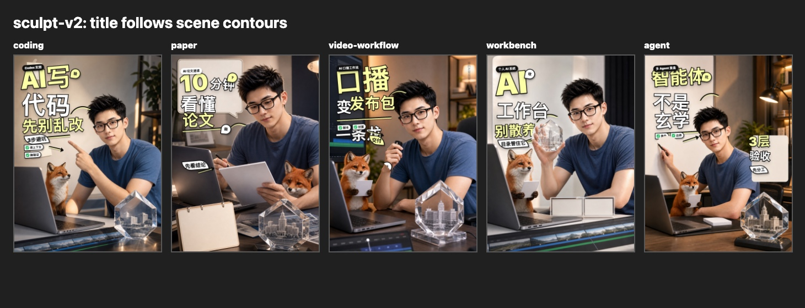
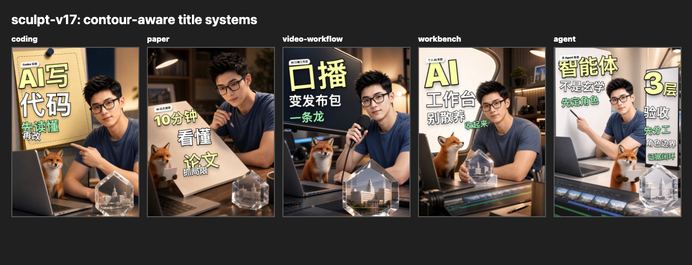
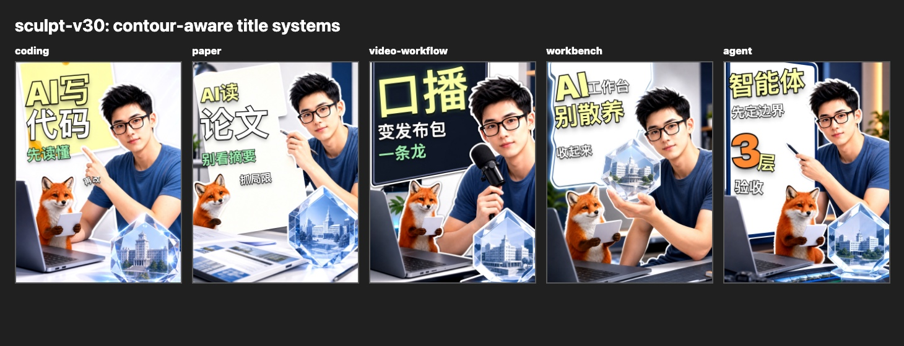
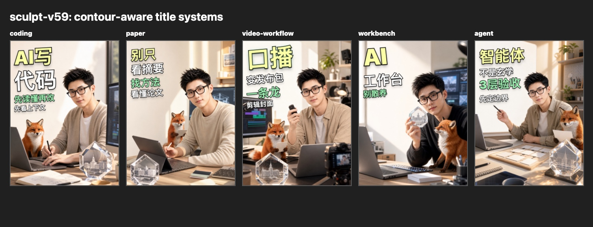
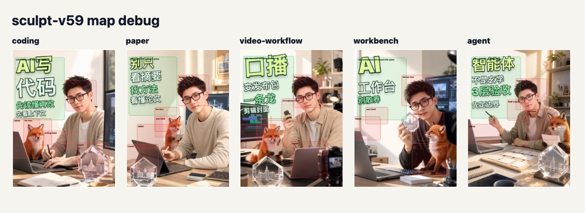
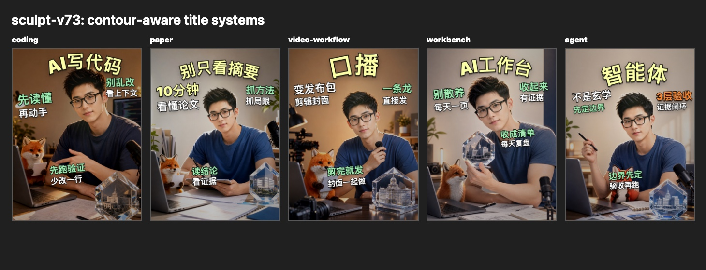
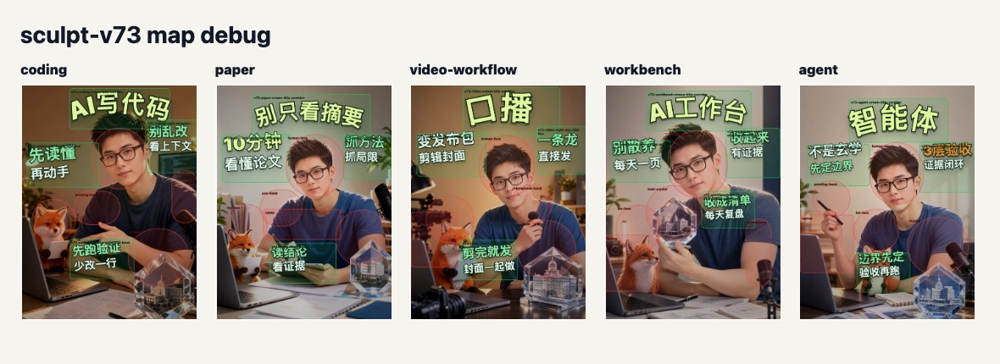
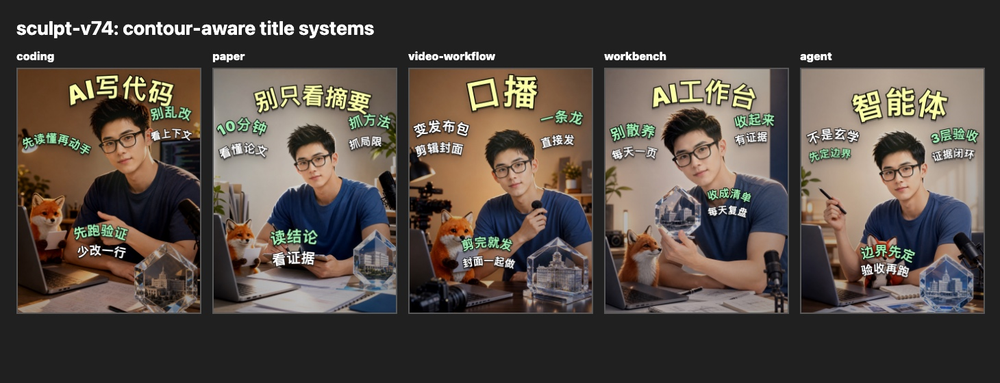
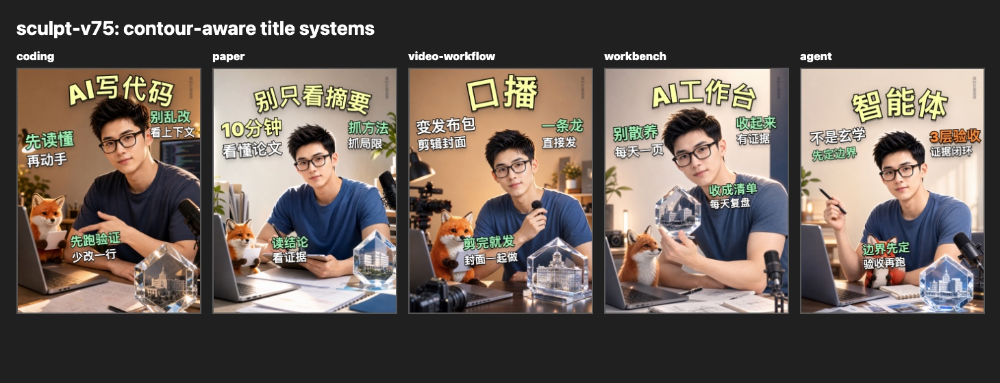
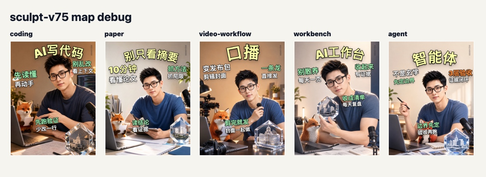

# 迭代故事：从贴字失败到封面委员会

这个项目不是从一张漂亮封面开始的，而是从反复失败开始的。

最早的问题很简单：底图看起来不错，人物、狐狸、水晶都有了，但标题仍然像后贴上去。它可能没有挡脸，也可能字很大、描边很粗，但它没有理解图像里的主题、人物和元素轮廓。

于是这个项目从“做封面”变成了“封面委员会”：每一版都要导出普通图和调试图，记录失败，升级规则，再生成下一版。

## 阶段 1：固定覆盖层失败，v2-v6

早期版本把标题当作安全覆盖层。它们避开了明显的人脸，却仍然像照片上贴说明。

失败点：

- 五张图共享相似的左上标题节奏；
- 小标签填满了空间，但没有形成封面结构；
- 狐狸、手、水晶只被粗略矩形保护；
- 标题没有跟当期主题物件发生关系。

## 阶段 2：物件承载，v7-v19

这一阶段开始明白：如果底图没有标题承载物，后期文字很难自然。便签、纸面、屏幕、白板、角色卡开始成为标题载体。

保留下来的经验：

- 标题要写在物件上或沿物件边缘走；
- 代码、论文、口播、工作台、智能体不能共用同一套结构；
- 中文标题仍然由本地 HTML 控制，不能交给模型生成乱码。

## 阶段 3：透视、前后景和边缘，v19-v44

有了承载物以后，标题还要进入空间：纸面有透视，屏幕有边缘，人物和狐狸有前景层级。

但这也带来风险：如果为了“贴合”而加太多前景切片、箭头、贴纸，封面会变碎。

## 阶段 4：对齐和无框，v52-v61

v59 是一个重要节点。它不靠底框、小长方形和突兀弧线，而是用直排轴线、大字层级和主体避让建立秩序。

这版的价值不是完美，而是证明了一件事：

> 文字贴近主体，不等于所有文字都要弯曲。

同组标题方向统一，左右和下方文本多数保持直排，反而更自然。

## 阶段 5：区域、头顶主标题和三分区，v67-v73

v67-v73 形成了更清晰的结构：头顶主标题、左右口袋、下方信息带。它把人物、狐狸、水晶、手势和工具分成不同区域，让标题不再只占一个抽象矩形。

这阶段的经验是：区域意识必须和审美判断一起存在。调试图能证明“不遮挡”，但不能自动证明“好看”。

## 阶段 6：v74 的教训

v74 尝试把更多文字都改成轮廓路径。它通过了部分区域检查，但审美上暴露了新的问题：如果左右和下方文本没有真实物件轮廓支撑，弯曲就会显得没有道理。

因此 v74 的正确教训是：

- 主标题可以跟人物头顶或真实任务轮廓走；
- 左右和下方文本通常应保持直排或轻微斜排；
- 弯曲必须有意义，不能为了“轮廓感”而弯曲；
- 区域检查只是底线，不是审美通过证。

## 阶段 7：v75 的修正

v75 不是重新发明一套风格，而是把 v74 的问题收回来：只保留主标题沿人物头顶/任务轮廓走，左右和下方文本恢复 v73 的直线排版逻辑。

这版固定了一条后续必须遵守的判断：

- 主标题弧线要有主体轮廓依据；
- 左右文字要保持同方向、同轴线；
- 下方文字应该像信息带，不应该变成没有意义的月牙；
- 调试图只能证明没有撞区，不能代替审美判断。

所以 v75 是当前修正版；v59、v73、v74 仍然都要保留在故事里。未来继续迭代时，不能只看最后一张图，而要知道每个规则是怎样被失败逼出来的。

## 下一步

后续维护不应该只追一个“最终版”。仓库要同时维护六种布局方案：头顶主标题、无框直排、物件承载、两侧口袋、下方信息带、文章卡。每次新增版本都要说明它属于哪种方案、解决了什么问题、又带来了什么新风险。
