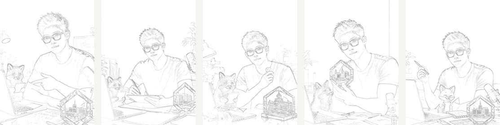

# Method

The cover committee method has one guiding idea: title design is a spatial system. It must read as text, protect the subject, and attach to the image structure.

## 1. Learn the Grammar, Do Not Copy the Source

The Atutun-style reference was used as a learning source for title grammar:

- thick, high-contrast Chinese title forms;
- large words with black outline and shadow;
- different title structures per topic;
- supporting labels used as rhythm, not as the main layout;
- creator/subject cutouts that interact with text.

The open package does not include third-party screenshots. It records observations and uses original/generated experiment images.

## 2. Name Real Regions

Do not start with `left-safe` or `top-safe`. Start with visible objects:

- `human-face-hard-zone`
- `fox-face-hard-zone`
- `crystal-hard-zone`
- `hand-gesture-hard-zone`
- `sticky-note-title-carrier`
- `paper-surface-title-carrier`
- `monitor-title-carrier`
- `whiteboard-title-carrier`
- `role-card-number-hammer`

The name should force the layout to answer: what object is carrying this title?

## 3. Separate Hard Zones, Soft Zones, and Carriers

Hard zones:

- human face, eyes, mouth;
- fox face and ears when they define the companion;
- crystal surface or brand-like object;
- hands when they explain the action;
- key tools such as microphone, pen, laptop, or screen focus.

Soft zones:

- shoulders, sleeves, desk edges, background gradients;
- object edges that can support a small overlap if foreground depth is added.

Carriers:

- paper, sticky notes, screens, whiteboards, speech bubbles, role cards, light panels.

Only carriers should hold main title mass. Soft zones may support tiny notes. Hard zones stay protected.

## 4. Build Title Mass Before Labels

The failed versions often used too many small labels. The stronger versions made the main title carry the cover.

Rule of thumb:

- one main title group owns 40-60% of the attention;
- line breaks and word scale fill space before extra stickers are added;
- 0-1 small badge is usually enough;
- if the cover looks empty, enlarge/restructure the main title before adding labels.

## 5. Match Shape to Theme

Each theme needs a different title structure:

- coding: tutorial blocks, sticky-note title fill, finger/laptop route;
- paper: paper surface, reading/understanding phrases, skewed title angle;
- video workflow: monitor/timeline surface, process words, screen-edge alignment;
- workbench: board/light-panel structure, crystal bypass, collection/organization wording;
- agent: whiteboard concept title plus right-side number hammer.

Stable visual language is allowed. Reusing the same layout skeleton is not.

## 5.5 Keep Straight Text Straight Unless the Image Earns a Curve

The v74 failure taught an important correction: contour-aware does not mean every text group becomes an arc.

- Main titles may curve when they follow a head top, subject gesture, or real object contour.
- Side and lower text should usually remain straight or lightly angled.
- A curved side/lower line must point to a visible reason: paper edge, screen edge, microphone, crystal, fox ear, desk edge, or another named contour.
- If the reader cannot explain the curve from the image, make it straight.

This is why v59 remains an important checkpoint.

v75 turns the correction into a current positive rule: the main headline may follow the human crown or task contour, while side-pocket and lower-band text should remain straight unless the image contains a named object contour that justifies bending.

## 6. Use Edge Evidence as a Review Layer

Edge evidence helps reveal real contours:

Use it to answer:

- where does the paper actually tilt?
- where does the crystal edge interrupt text?
- where does the fox head need foreground priority?
- where does the whiteboard or monitor begin/end?

The edge board is not an automatic layout result. It is evidence for the next deterministic HTML decision.

## 7. Keep Chinese Title Placement Deterministic

Generated image models are useful for base images and image-to-image refinement, but final Chinese title placement should be deterministic:

- write final text in HTML/CSS or another controllable layout layer;
- avoid asking the image model to render final Chinese title words;
- export ordinary and debug boards together;
- run collision checks before reviewing aesthetics.

This is why the original experiment used the HyperFrames renderer and a layout-check script.

## 8. Review in Three Passes

Full-size pass:

- Is the title complete and readable?
- Are subject, fox, and crystal intact?
- Does the title follow the carrier object?

Thumbnail pass:

- Does the main title survive small-screen scrolling?
- Are there too many tiny labels?
- Is the first hook visible without reading every word?

Debug pass:

- Do title boxes avoid hard zones?
- Do debug zones match real visual objects?
- Does edge evidence support the chosen carrier?
